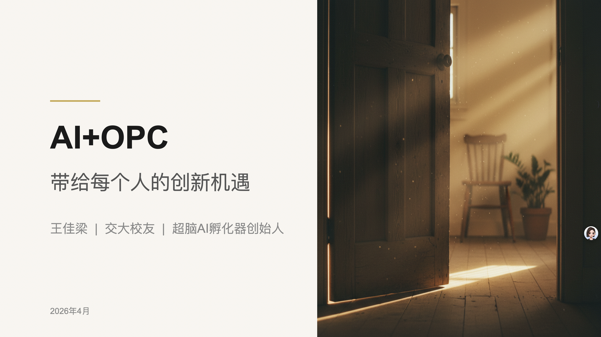
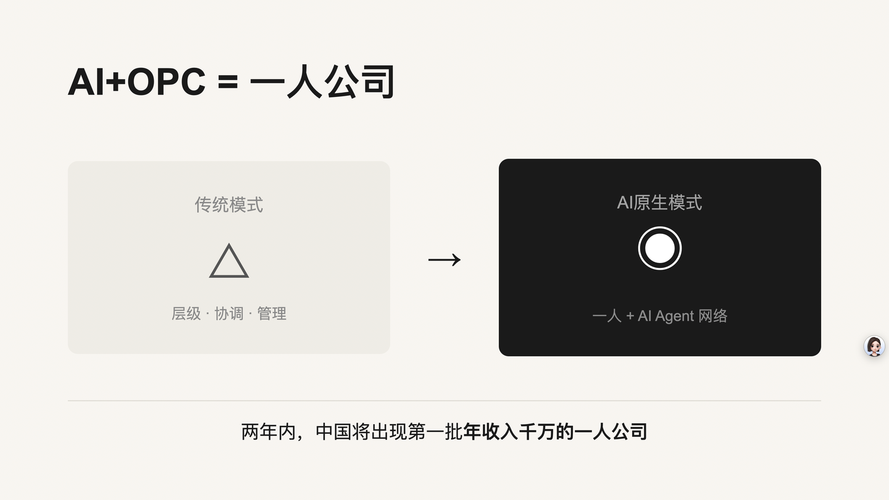

# PPT 自动生成工作流

对 AI 说"做 PPT"，从大纲到成品 PPTX 全自动。





> 以上是用本工作流全自动生成的演讲 PPT（20 页，从大纲到成品约 15 分钟）。完整示例文件见 [docs/examples/demo.pptx](docs/examples/demo.pptx)。

---

## 为什么需要这个？

市面上 AI PPT 工具不少，但用下来总有几个痛点：

**1. 没有你自己的知识库**

网页端工具只能用通用知识，生成的内容空洞。本工作流运行在 Claude Code / OpenClaw 等本地 AI Agent 里，可以直接读你的飞书文档、本地笔记、内部资料——基于真实内容写 PPT，深度完全不同。

**2. 模板太丑**

所以我精选了 15 种高质量风格，参考真实产品调性设计，覆盖科技发布、商业汇报、TED 演讲、创业路演等场景。你也可以自定义风格。

**3. 不能编辑**

NotebookLM 等工具生成的 PPT 无法修改。本工作流输出标准 `.pptx` 文件，PowerPoint / Keynote 直接打开编辑。

**4. 配图方式单一**

本工作流支持三种配图来源：
- 本地文件（你自己的素材）
- AI 生成（Google Gemini）
- 免费图库（Pexels）

配图基于情绪匹配，不是按关键词搜图。

---

## 工作流程

```
大纲 → 需求确认 → 风格选择（15种）→ HTML 幻灯片 → AI 配图 → PPTX → 质量审核
```

7 个阶段全部由 AI 自动完成：

1. **需求确认** — AI 读完大纲后确认场景、受众、风格偏好
2. **设计系统** — 自动生成配色板、字体规则、页面明暗节奏
3. **HTML 生成** — 每页生成独立 HTML 文件
4. **AI 配图** — 基于每页的情绪目标生成或搜索配图
5. **构建 PPTX** — HTML 自动转换为 PPTX
6. **质量审核** — 自动检查对比度、布局、内容、图片质量
7. **交付迭代** — 打开预览，你可以要求修改

---

## 15 种可用风格

| 风格 | 适用场景 |
|------|----------|
| Apple Bento Grid | 产品发布、科技展示 |
| McKinsey Consulting Blue | 商业汇报、咨询报告 |
| TED Talk Minimal | 演讲、思想传播 |
| Netflix Dark Entertainment | 创意展示、品牌故事 |
| Spotify Gradient | 年轻品牌、音乐文化 |
| Glass-Morphism Tech | AI / 科技主题 |
| Brutalism | 先锋设计、颠覆性内容 |
| Editorial Magazine | 文化、艺术、深度内容 |
| Wabi-Sabi | 禅意、东方美学 |
| Luxury Dark Gold | 高端品牌、奢侈品 |
| Silicon Valley Pitch | 创业路演、融资 |
| Notion/Linear Minimal | 内部分享、技术文档 |
| Bold Gradient | 营销、活动宣传 |
| Data Visualization | 数据报告、分析展示 |
| 发布会全图大字 | 发布会、TED 式演讲 |

不确定选哪个？不用选——AI 会根据你的演讲场景推荐。

---

## 快速开始

### 前置条件

- **AI Agent**：Claude Code / OpenClaw / Cowork / 腾讯 WorkBuddy（任选一个）
- **Node.js** 18+
- **Python** 3.10+

### 一步部署：让 AI 帮你装

把下面这段话发给你的 AI Agent：

> 帮我部署 PPT 工作流。克隆 https://github.com/wangjialiang678/ppt-workflow ，然后按照仓库里 DEPLOY.md 的步骤执行。

AI 会自动完成所有安装（约 2-3 分钟）：克隆仓库 → 安装 Skills → 安装依赖 → 配置 API Key。

### API Key（免费）

工作流需要两个 API Key，都可以免费申请：

| Key | 用途 | 申请地址 |
|-----|------|---------|
| GEMINI_API_KEY | AI 生成配图 | [Google AI Studio](https://aistudio.google.com/apikey) |
| PEXELS_API_KEY | 免费图库搜索 | [Pexels API](https://www.pexels.com/api/) |

### 开始使用

部署完成后，在 AI Agent 中直接说：

```
做 PPT，主题是"AI 改变工作方式"
```

更多用法：

- **指定风格**："做 PPT，主题是 XXX，风格选 Apple Bento"
- **提供大纲**："把这个大纲做成 PPT" + 粘贴内容
- **指定场景**："帮我做一个投资路演 PPT，20 页"

---

## 常见问题

**Q：生成一套 PPT 要多久？**
A：10-20 页通常 5-15 分钟，取决于 AI 配图数量。

**Q：可以修改吗？**
A：输出是标准 .pptx 文件，可以在 PowerPoint / Keynote 里编辑。也可以告诉 AI "第 3 页换个风格"，它会针对性修改。

**Q：不满意怎么办？**
A：直接告诉 AI 哪里不好，它会迭代。可以说"重做第 X 页"。

---

## 仓库结构

```
ppt-workflow/
├── README.md              ← 本文件（项目介绍）
├── DEPLOY.md              ← AI Agent 部署手册
├── skills/                ← 4 个 AI 技能包
│   ├── ppt-workflow/      ← 主工作流编排
│   ├── pptx/              ← HTML → PPTX 转换
│   ├── nano-banana/       ← AI 配图（Gemini）
│   └── image-forge/       ← AI 配图（备选）
├── PPT制作/
│   ├── styles/            ← 15 种风格定义
│   └── workspace/         ← 构建脚本 + 依赖
├── docs/
│   ├── examples/          ← 示例 PPTX
│   └── screenshots/       ← 截图
└── api-keys/
    └── api-keys.env.example
```

## License

MIT
